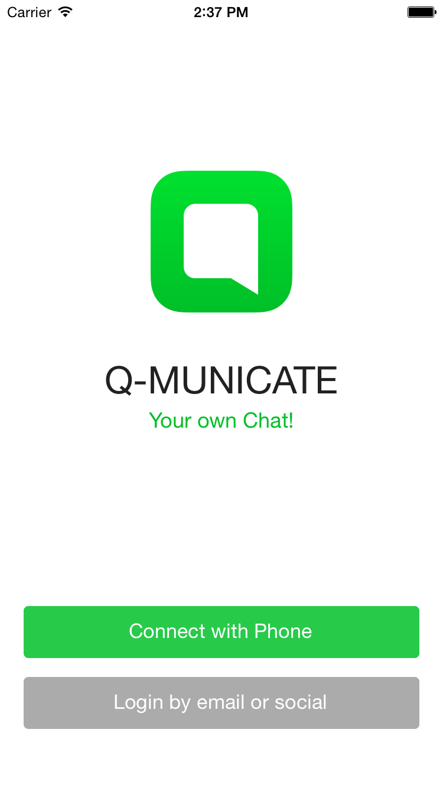

# Q-municate

Q-municate is an open source code of chat application with full range of communication features on board (such as messaging, file transfer, push notifications, audio/video calls, etc.).

We are inspired to give you chat application out of the box. You can customise this application depending on your needs. As always QuickBlox backend is at your service: https://quickblox.com/plans/

Find the source code and more information about Q-municate, as well as installation guide, in our Developers section: https://quickblox.com/developers/q-municate

## Q-municate IOS
This guide is brought to you from QuickBlox iOS team in order to explain how you can build a communication app on iOS using QuickBlox API.

It is a step by step guide designed for all developer levels including beginners as we move from simple to more complex implementation. Depending on your skills and your project requirements you may choose which parts of this guide are to follow. Enjoy and if you need assistance from QuickBlox iOS team feel free to let us know by creating an [issue](https://github.com/QuickBlox/q-municate-ios/issues).

Q-municate is a fully fledged chat application using the Quickblox API.

## Q-municate application uses following QuickBlox modules:

* [Authentication](http://quickblox.com/developers/Authentication_and_Authorization)
* [Users](http://quickblox.com/developers/Users)
* [Chat](http://quickblox.com/developers/Chat)
* [Video calling](http://quickblox.com/developers/VideoChat)
* [Content](http://quickblox.com/developers/Content)
* [Push Notifications](http://quickblox.com/developers/Messages)

## It includes such features as:

* Three sign-up methods as well as login – [Facebook](Facebook), [Twitter Digits](https://get.digits.com) (e.g. phone number) and with email/password
* View list of all active chat dialogs with message history (private and group chat dialogs)
* View, edit and leave group chat dialogs
* View and remove private chat dialogs
* Search: local dialogs search, contacts search and global users search
* Create and participate in private and group dialogs
* Managing, updating and removing dialogs
* Audio and Video calls (using QuickBlox WebRTC Framework)
* Edit own user profile
* Reset password and logout
* See other users profile
* Pull to refresh for dialogs list, contacts list and user info page
* Easy to add localisation

Please note all these features are available in open source code, so you can customise your app depending on your needs.

## Requirements

* [Xcode 7](https://developer.apple.com/library/ios/documentation/DeveloperTools/Conceptual/WhatsNewXcode/Articles/xcode_7_0.html) and later.
* [QuickBlox iOS SDK](http://quickblox.com/developers/IOS) 2.7.3 and later.
* [QMServices](https://github.com/QuickBlox/q-municate-services-ios) 0.4.1 and later.
* [QMChatViewController](https://github.com/QuickBlox/QMChatViewController-ios) 0.3.8 and later.
* [Facebook iOS SDK](https://developers.facebook.com/docs/ios) 4.11 and later.
* [Twitter Digits](https://fabric.io/kits/ios/digits) 1.15 and later.

## Software Environment

* The iOS application runs on any Apple device that supports iOS 8.1 and later.
* The iOS application is developed as native IOS application.
* The iOS application has English language interface and easy to add localisation.
* The App supports both landscape and portrait mode.

_______

## First look into project
### Welcome Screen

#### Available features:
#### Buttons:
* Connect with Phone – this button allows user to enter the App with his/her phone number using Twitter Digits. If tapped will be shown User Agreement pop-up.
* Login by email or social button – By tapping this button action sheet with extra login methods will pop up. There is such methods as Facebook login and login by email/password.
* Login with Facebook allows user to enter the App with his/her Facebook credentials. If tapped will be shown User Agreement pop-up.
* If App has passed Facebook authorisation successfully, the App will redirect user into chat dialogs list screen.
* Login by email/password allows user to enter the App if he/she provides correct and valid email and password. By tapping on this button user will be redirected to the login screen.

###### Please note, that there is no longer a possibility to sign up user using email and password method. You can only sign up using Phone number and/or Facebook credentials.

### Login with email/password page

 

#### Available features:
#### Fields set:

* Email – text/numeric/symbolic fields 3 chars min - no border, mandatory (email symbols validation included)
* Password – text/numeric/symbolic field 8-40 chars (should contain alphanumeric and punctuation characters only) , mandatory

#### Buttons

* Back - returns user back to welcome screen
* Done - performing login after fields validation using provided email and password
* Forgot password - opens forgot password screen

### Forgot password screen

#### Fields set:

* Email – text/numeric/symbolic fields 3 chars min - no border, mandatory (email symbols validation included)

#### Buttons

* Back - returns user back to welcome screen
* Reset - performing password reset

### Tab Bar

Tab bar is a main controller of the application. It is consists of such pages:

* Chat dialogs list (main page)
* Contacts list
* Settings

### Chat Dialogs List Screen

#### Search

Search allows user to filter existing dialogs in local cache by its names.

#### Buttons

* Right bar button - redirects user to new dialog screen

### New Message Screen

You can select contact on this page in order to start a private chat with him/her.

#### Search

Search allows user to filter contacts by their full names

#### Buttons

* Right bar button - redirects user to group chat creation page
* Back - return user back to chat dialogs page

### New Group Screen

#### Fields set

* Group name field - group chat dialog name, mandatory
* Tag search field - allows user to filter contacts by their full name and manage already selected ones in tag field

#### Buttons

* By tapping on avatar action sheet will be opened, user can either take a new photo or select an already existent one from library to set as group photo (optional)
* Next - creates a group chat with selected users and redirects to chat view controller page
* Back - return user back to chat dialogs screen

### Private Chat Screen

#### Buttons

* Right bar buttons - Audio and Video call buttons, you can only call user if he is in your contact list
* Back - returns user back to chat dialogs list screen
* Navigation bar title - redirects user to opponent profile page

### Group Chat Screen

#### Buttons

* Right bar button and navigation bar title - redirects user to group chat info screen
* Back - return user to chat dialogs list screen
* Opponent user avatars - by tapping opponent user avatars in messages you will be redirected to the info page of that user

### Group Info Screen

#### Fields/Buttons

* By tapping on group avatar you can change it with either take a new photo or selecting it from library
* By tapping on group name you will be redirected to group name change screen
* By tapping on Add member field you will be redirected to contacts screen in order to select users to add
* By tapping on any user in members list you will be redirected to their info page (except your own user in list)
* By tapping Leave and remove chat field - you will leave existent group chat and delete it locally

### Contacts List Screen

#### Search

Search has two scopes buttons:

* Local search - allows user to filter existing contacts by their names.
* Global search - allows user to find users and see their profiles by full names.

### User Info Screen

#### Fields/Buttons

Contacts actions:

* Send message - opens chat with user, if there is no chat yet - creates it
* Audio Call - audio call to user
* Video Call - video call to user
* Remove Contact and Chat - deleting user from contact list and chat with him

Other user actions:

* Add contact - sending a contact request to user or accepting existing one

### Settings Screen

#### Fields/Buttons

* Full name, status and email fields will redirect you to update field screen, where you can change your info.

* By tapping on avatar action sheet will be opened. You can either take a new picture or choose it from library to update your user avatar.
* Push notification switch - you can either subscribe or unsubscribe from push notifications.
* Tell a friend - opens share controller where you can share this awesome app with your friends :)
* Give feedback - feedback screen, where you can send an email to us with bugs, improvements or suggestion information in order to help us make Q-municate better!

## Code explanation

## How to build your own Chat app

If you want to build your own app using Q-municate as a basis, please follow our [detailed guide here](http://quickblox.com/developers/Q-municate#How_to_build_your_own_Chat_app).
 
# License
Apache License, Version 2.0. See [LICENSE](LICENSE) file.